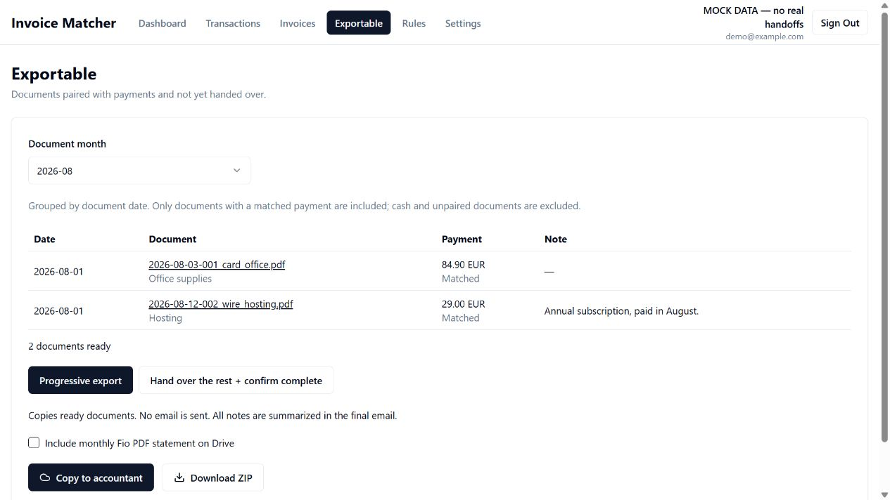
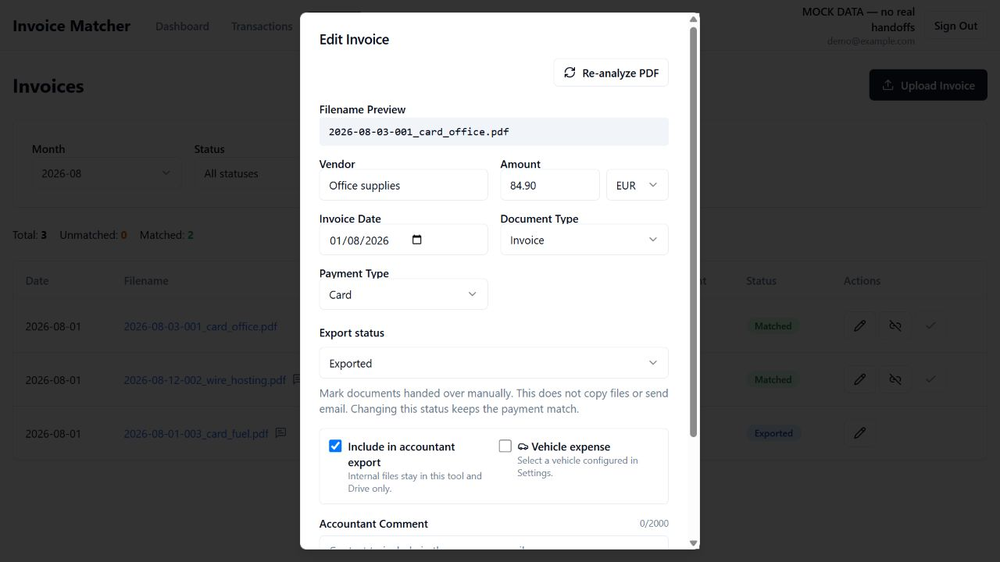
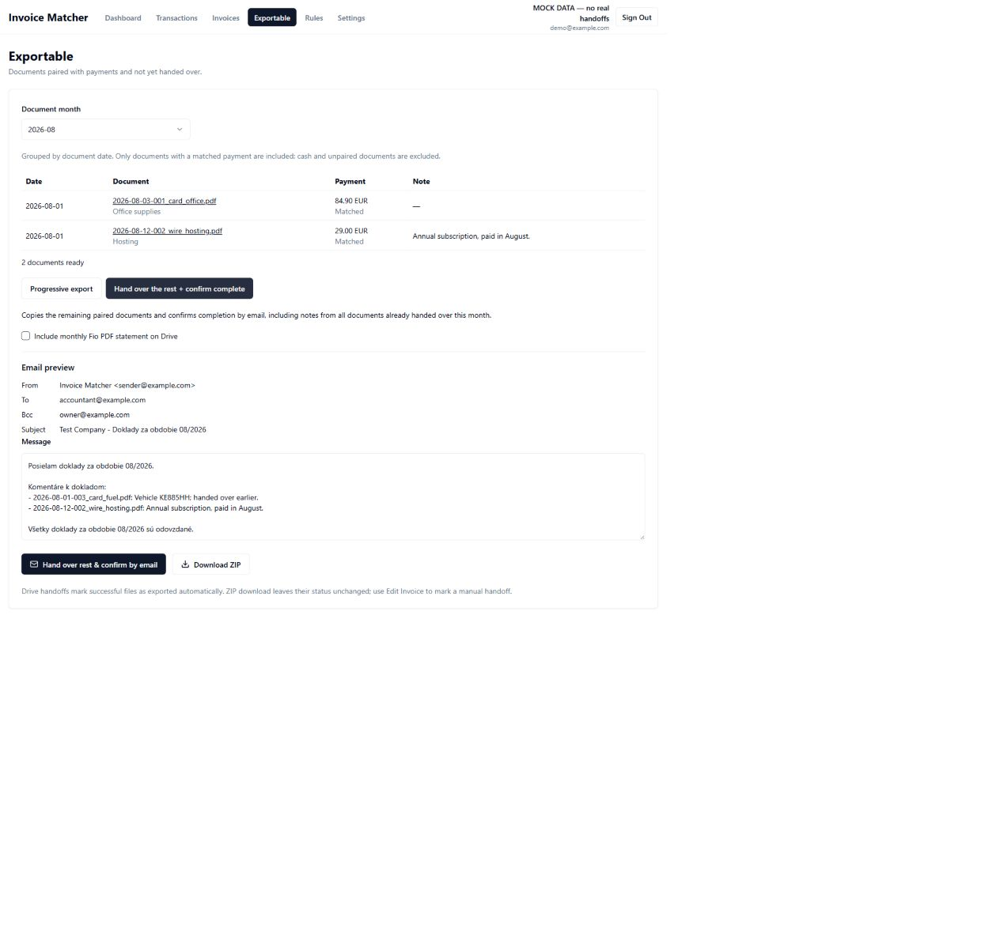

# Progressive accountant handoff — UI mocks

These screenshots use fictional data in the actual frontend. Drive and Mailjet are mocked.

## Progressive export

Only paired, unexported documents appear. Copying sends no email.

## Manual export status

Edit Invoice can mark a manual handoff without sending files or email.

## Final handoff

The final email includes notes from the remaining documents and documents handed over earlier.

To run the interactive mock locally, build the frontend with `npm run build` in `frontend`, then run `uv run python tests/mock_preview.py` from the project root. Open http://localhost:8765/exportable?month=2026-08. All data resets when the mock server restarts.
